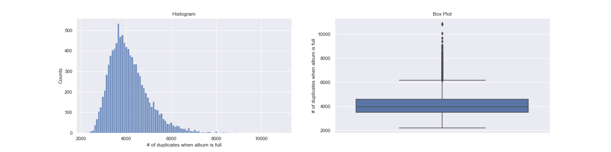
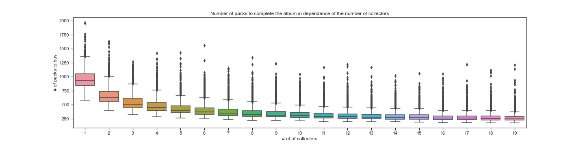
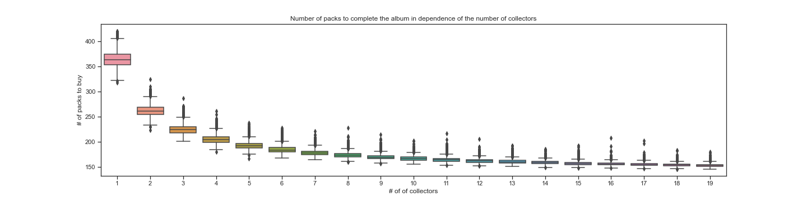
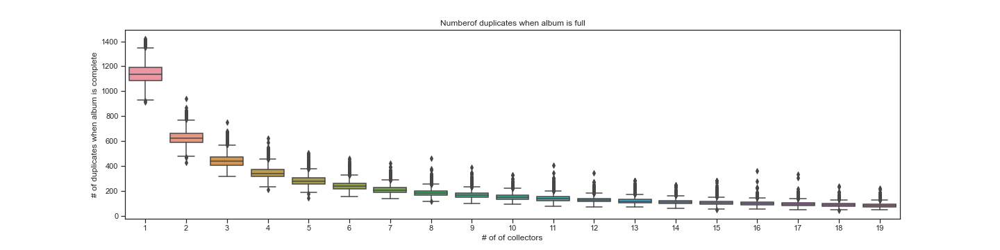

# Monte-Carlo simulation to estimate the cost of a complete Panini sticker album

## Background
It is now almost a tradition that with each new football cup, a new collection of Panini stickers is available. The Panini sticker album of the UEFA Euro 2020
contains 678 stickers, where the stickers can be bought in packs of 5 stickers. It has been shown [1] that the stickers are uniformly distributed and that there is no planned shortage of some stickers.

For collectors, the question arises of how much they have to spend to fill the complete album. Furthermore, the influence of swapping stickers is a very interesting question. 

Here, I present the analysis of some Monte-Carlo simulations in order to answer these questions.


## Assumptions
- The Panini sticker album contains 678 stickers
- A pack of Panini stickers costs 1.1 CHF and contains 5 stickers
- The stickers are distributed uniformly. This means, a pack might contain duplicates.

# Results

## No swapping
The first analysis assumes a person trying to complete the album without swapping stickers. This situation leads to the analytical solution for the expectation of the number of required packets to fill the album [1, 2, 3].

```math
{N \choose k} \sum_{i=1}^{N} (-1)^{i+1} \dfrac{{N \choose i}}{{N \choose k} - {N-i \choose k} }
```
where `N =  # of sticker in the album`, `k = # of sticker in one pack`.

The Monte-Carlo simulation can be found in Panini_MonteCarlo.ipny. The simulation works a follows:

1) Initialize the album as an array of zeros with the length = # of sticker in the album
2) Repeat the following steps until the album array does not contain any zeros entries anymore
	
	2.1) Generate a pack of five uniformly, randomly distributed stickers 
	
	2.2) For each sticker in the pack, increase the entry with the sticker ID in the album array by one.

This simulation is the run for 2000 times. 

### Amount of packs to buy to fill the album


|Probability | 10% | 20% | 30% | 40% | 50% | 
| --- | --- | --- | --- | --- | --- |
|# Packs to buy | < 770 | < 818 | < 859 | < 594 | < 933 |
|  | < 1193 | < 1088 | < 1025 | > 976 |  |

The median is at 933 packs. This means that 50% of the simulations needed more than 933 and 50% needed less than 933 packs to fill the album. In other words, from the table one can see that the "lucky" 10% need less than 770 packs to 
fill the album. However, there is an equal probability that one has to buy more than 1193 packs to complete the album.

### Amount of duplicates when completing the album



|Probability | 10% | 20% | 30% | 40% | 50% | 
| --- | --- | --- | --- | --- | --- |
|# of duplicates | < 3172 | < 3412 | < 3617 | < 3792 | < 3987 |
| | < 5287 | < 4762 | < 4447 | > 4202 |  |

If one does not swap any stickers, the median of the amount of duplicated stickers is 3987. 

**In conclusion, it is a very expensive strategy to fill the album without swapping stickers**

## With swapping

### Idealized swapping
In a fist step, the situation of ideal swapping is analyzed with multiple collectors. The simulation set-up is as follows:

The simulation contains of *n* time steps until the album of each collector is full
At each step:
- Each collector with an uncompleted album buys one sticker pack and adds the stickers to his album
- Each collector swaps his duplicates with each other collector. This happens in random order to not favor one collector. Collectors with a full sticker book still participate the swapping process.

#### Amount of packs to buy to fill the album


Obviously, on average, you need to buy less sticker packs if you are able to swap the stickers with others. Anyhow, there are sill some outliers that needed to buy more than 1000 packs of stickers, even en the case of 19 collectors.
The reason for this is that collectors that complete their album stop buying stickers because they have no need for new stickers. In the case where most of the collectors are lucky and finish their books very early, the ones that have not finished the books yet have
then access to only a limited set of stickers that they can swap.


**Five collectors**
|Probability | 10% | 20% | 30% | 40% | 50% | 
| --- | --- | --- | --- | --- | --- |
|# Packs to buy | < 326 | < 346 | < 363 | < 383 | < 440 |
|  | < 604 | < 511 | < 460 | > 430 |  |

**Ten collectors**
|Probability | 10% | 20% | 30% | 40% | 50% | 
| --- | --- | --- | --- | --- | --- |
|# Packs to buy | < 251 | < 266 | < 277 | < 290 | < 305 |
|  | < 457 | < 387 | < 346 | > 322 |  |

#### Amount of duplicates when completing the album


**Five collectors**
|Probability | 10% | 20% | 30% | 40% | 50% | 
| --- | --- | --- | --- | --- | --- |
|# of duplicates | < 952 | < 1052 | < 1137 | < 1237 | < 1337 |
| | < 2342 | < 1877 | < 1622 | > 1473 |  |

**Ten collectors**
|Probability | 10% | 20% | 30% | 40% | 50% | 
| --- | --- | --- | --- | --- | --- |
|# of duplicates | < 577 | < 652 | < 707 | < 772 | < 847 |
| | < 1607 | < 1257 | < 1052 | > 932 |  |


**In conclusion, finding a lot of other collectors that are willing to swap stickers helps to reduce the amount of stickers that have to be bought to complete the album.**
**However, even for 10 collectors, the median number of duplicated stickers when completing the album is 847.**


## Including the possibility to buy missing stickers
Panini offers the possibility to buy up to 50 missing stickers directly over their website. To investigate the influence of this possibility, the simulations are again performed as above, but including:
- Collectors that have equal or less than 50 missing stickers buy them directly and complete the album in this way.

### Amount of packs to buy to fill the album


**One collector**
|Probability | 10% | 20% | 30% | 40% | 50% | 
| --- | --- | --- | --- | --- | --- |
|# Packs to buy | < 343 | < 350 | < 355 | < 359 | < 363 |
| | < 385 | < 377 | < 372 | > 367 |  |

**Five collectors**
|Probability | 10% | 20% | 30% | 40% | 50% | 
| --- | --- | --- | --- | --- | --- |
|# Packs to buy | < 176 | < 179 | < 180 | < 182 | < 183 |
| | < 193 | < 187 | < 187 | > 185 |  |

**Ten collectors**
|Probability | 10% | 20% | 30% | 40% | 50% | 
| --- | --- | --- | --- | --- | --- |
|# Packs to buy | < 159 | < 161 | < 162 | < 163 | < 164 |
| | < 170 | < 168 | < 166 | > 165 |  |


### Amount of duplicates when completing the album


**One collector**
|Probability | 10% | 20% | 30% | 40% | 50% | 
| --- | --- | --- | --- | --- | --- |
|# of duplicates | < 1037 | < 1072 | < 1097 | < 1117 | < 1137 |
| | < 1247 | < 1207 | < 1182 | > 1161 |  |

**Five collectors**
|Probability | 10% | 20% | 30% | 40% | 50% | 
| --- | --- | --- | --- | --- | --- |
|# of duplicates| < 237 | < 252 | < 262 | < 271 | < 279 |
| | < 338 | < 313 | < 299 | > 189 |  |

**Ten collectors**
|Probability | 10% | 20% | 30% | 40% | 50% | 
| --- | --- | --- | --- | --- | --- |
|# of duplicates | < 124 | < 132 | < 140 | < 145 | < 151 |
| | < 189  | < 175 | < 166 | > 158 |  |


Using the possibility to buy missing stickers reduced the mean number of sticker packs to buy for a single collector from 933 to 363. In case of five collectors, the mean number of sticker packs reduces from 440 to 183. More importantly,
the "unlucky" outliers that had to buy more than 1000 stickers, even in the case of many collectors, can be eliminated by buying missing stickers. 


## Conclusion
The best strategy to fill the album is to swap the stickers with as many other collectors as possible and directly buy the last 50 missing stickers over the panini website.

## References
[1] https://www.unige.ch/math/folks/velenik/Vulg/Paninimania.pdf

[2] Adler, Ilan and Ross, Sheldon M.:The  coupon  subset  collection  problem, J. Appl. Probab.38 (2001), no. 3, 737–746.

[3] Stadje, Wolfgang:The  collector’s  problem  with  group  drawings., Adv. in Appl. Probab. 22(1990), no. 4, 866–882